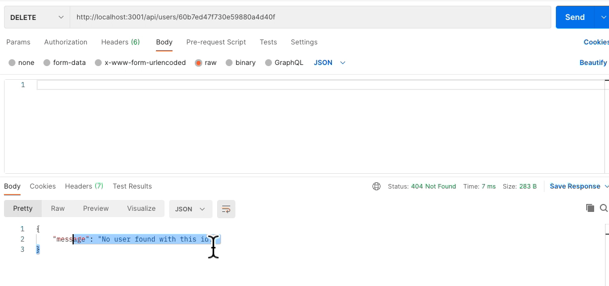

### 18. NoSQL Challenge: Social Network API

## Description 

Hello CEO of social media startup
YOU WANT an API for your social network that uses a NoSQL database
SO THAT your website can handle large amounts of unstructured data

## Table of Contents (Optional)

* [Installation](#installation)
* [Usage](#usage)
* [Technology](#technology)
* [Credits](#credits)
* [License](#license)

## Installation

- Please visit Website https://github.com/richardyjkim/social-network-API

# Usage 

- User Schema with friends created

- Thought Schema with Reaction passing

- Server connection successfully

- Get All user successfully
- watch video for more views

- get all thought successfully
- watch video for more views

- let's add jane. 

- jane has a something to say
- watch video for more views

- she says "hi"

- she doesn't want to join social medai.
- so she deleted her account... bye Jane

- Further Details please watch Demo Video (located in ./Assets/video)

## Technology
    - Express
    - Npm
    - Java Script
    - nodejs
    - postman
    - MongoDB(mongoose)

## Credits

 - Richard Kim: richardyjkim (github)

## License

MIT License

Copyright (c) [2021] [Richard Y Kim]

Permission is hereby granted, free of charge, to any person obtaining a copy
of this software and associated documentation files (the "Software"), to deal
in the Software without restriction, including without limitation the rights
to use, copy, modify, merge, publish, distribute, sublicense, and/or sell
copies of the Software, and to permit persons to whom the Software is
furnished to do so, subject to the following conditions:

The above copyright notice and this permission notice shall be included in all
copies or substantial portions of the Software.

THE SOFTWARE IS PROVIDED "AS IS", WITHOUT WARRANTY OF ANY KIND, EXPRESS OR
IMPLIED, INCLUDING BUT NOT LIMITED TO THE WARRANTIES OF MERCHANTABILITY,
FITNESS FOR A PARTICULAR PURPOSE AND NONINFRINGEMENT. IN NO EVENT SHALL THE
AUTHORS OR COPYRIGHT HOLDERS BE LIABLE FOR ANY CLAIM, DAMAGES OR OTHER
LIABILITY, WHETHER IN AN ACTION OF CONTRACT, TORT OR OTHERWISE, ARISING FROM,
OUT OF OR IN CONNECTION WITH THE SOFTWARE OR THE USE OR OTHER DEALINGS IN THE
SOFTWARE.

© 2021 Trilogy Education Services, LLC, a 2U, Inc. brand. Confidential and Proprietary. All Rights Reserved.
